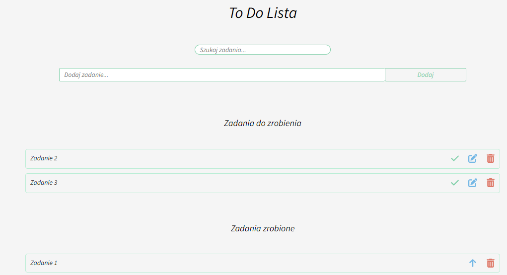
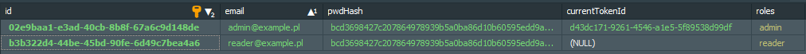
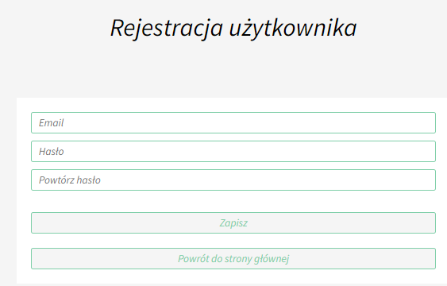
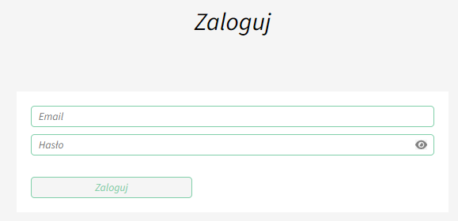
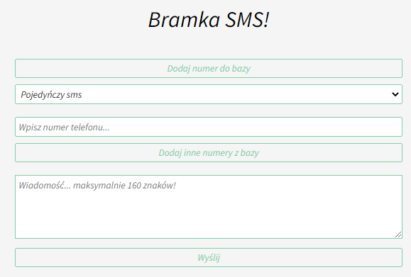
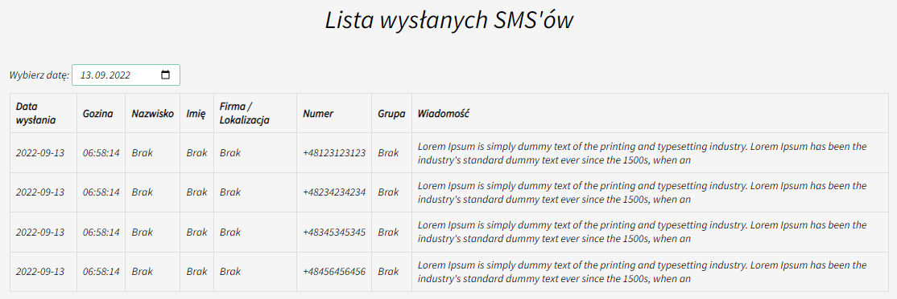
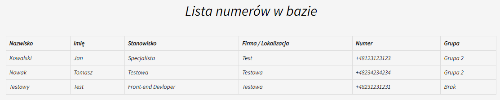
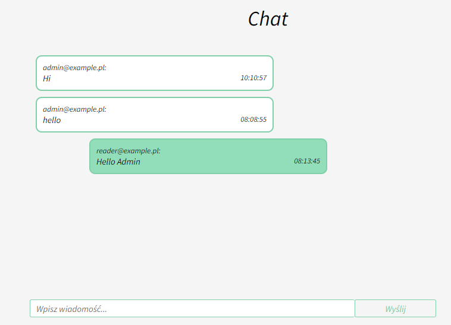

## Description

### To Do List Module:
The application was created during the MegaK course as ToDo List.
You can add tasks, edit, mark as done, delete and filter.
Then the app was expanded with new functions.



### User Module:<br/>
The User module has been added, in which we can register a new user. The database (mysql or postgres) will save the email and the encrypted password using the algorithm - sha512.
We can also assign roles to an Admin or Reader user.




### Auth Module:
Then the Auth module was added, in which we can log in or log out the user.
When logging in, the user and password are checked in the database, then the user token is created and saved in the database.
The 'jwt' cookie is sent to the browser as httpOnly.
When logging in again, the frontend sends back 'jwt' and the token is compared with the database.

Logging out removes the token from the database and from the cookie "jwt" from the browser.

#### Register


#### Login<br/>


### SMS Module:
Then an SMS module was added for sending single text messages and sending text messages to the created groups.
In this module, you can add a telephone number along with other data (name, surname, company, location, group) to the database. We can edit the given number and other data.
By sending a single text message or to a group, information about the content of the text message and the user is saved in the database. Then the database handles the sending of text messages to the operator.



The SMS module also allows filtering by date of sent text messages.



You can check the list of numbers in the database.



### Chat Module:
Then the Chat module was created.
The module enables the exchange of information between logged in people in real time.



### Mail Module:
Then the Mailer module was added, which in this application allows you to send an email after registering a new user.

### .env file
The server data and data for logging into the database are stored in an .env file.

## Installation

```bash
$ npm install
```

## Running the app

```bash
# development
$ npm run start

# watch mode
$ npm run start:dev

# production mode
$ npm run start:prod

# listen
The application listens on the address: http://localhost:3001

# database
The application connects to the local database 
You can use the XAMP program (https://www.apachefriends.org/pl/index.html). 
Then you need to connect to the database using, for example the Heidi program (https://www.heidisql.com/download.php).
Create a database and enter a name for the .env file.

###Frontend React
The frontend in React was created for this application.
Frontend link is here: https://github.com/RafalKuchta/ToDoMegakFrontend-React-NestJs

```

## Test

```bash
# unit tests
$ npm run test

# e2e tests
$ npm run test:e2e

# test coverage
$ npm run test:cov
```